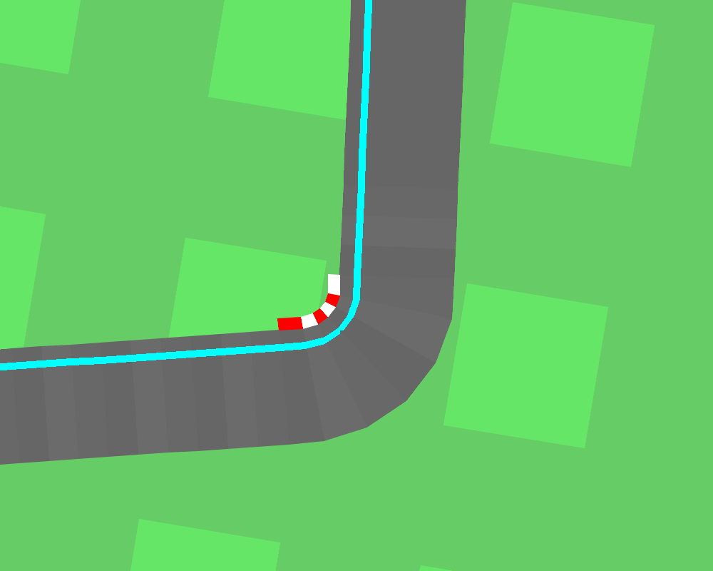

# Gym-CarRacing-Control
**Objective:**
The goal of this project is to implement a PID controller or a MPC controller to enable a car in the CarRacing environment from OpenAI's Gym library to follow a predefined path or track. 

|      |              left track              |               middle track               |              right track               |
| :--: | :----------------------------------: | :--------------------------------------: | :------------------------------------: |
|      |  |  |  |
| PID  |              |              |              |
| MPC  |      |      |      |

------

## 1.Trajectory Masking

- **Input:** RGB image of the environment(96*96)
- **Output:** masks for left, middle, and right trajectories
- **Steps:**
  - Define HSV color ranges for each trajectory:
    - Cyan: Left side of the track.
    - Magenta: Middle of the track.
    - Blue: Right side of the track.
  - Apply `cv2.inRange()` to generate masks

## 2.Target Point Calculation

- **Input:** masked image, strip distance, and trajectory mode
- **Output:** target point coordinates
- **Steps:**
  - Extract the relevant mask based on `MODE`
  - Identify non-zero pixels in the strip
  - Compute the target point as the closest pixel to the center

## 3.Error and Steering Angle Calculation

- **Input:** target point, car position
- **Output:** error, angle
- **Steps:**
  - Calculate position error and steering angle
  
## 4.Control Action Calculation

- **Input:** Steering angle, velocity error, PID controllers
- **Output:** Control actions
- **Steps:**
  - steering=pid(angle)
  - gas,brake=[pid(error_v), 0] if error_v > 0
  - gas,brake=[0, pid(error_v)] if error_v < 0
------

## Star History

